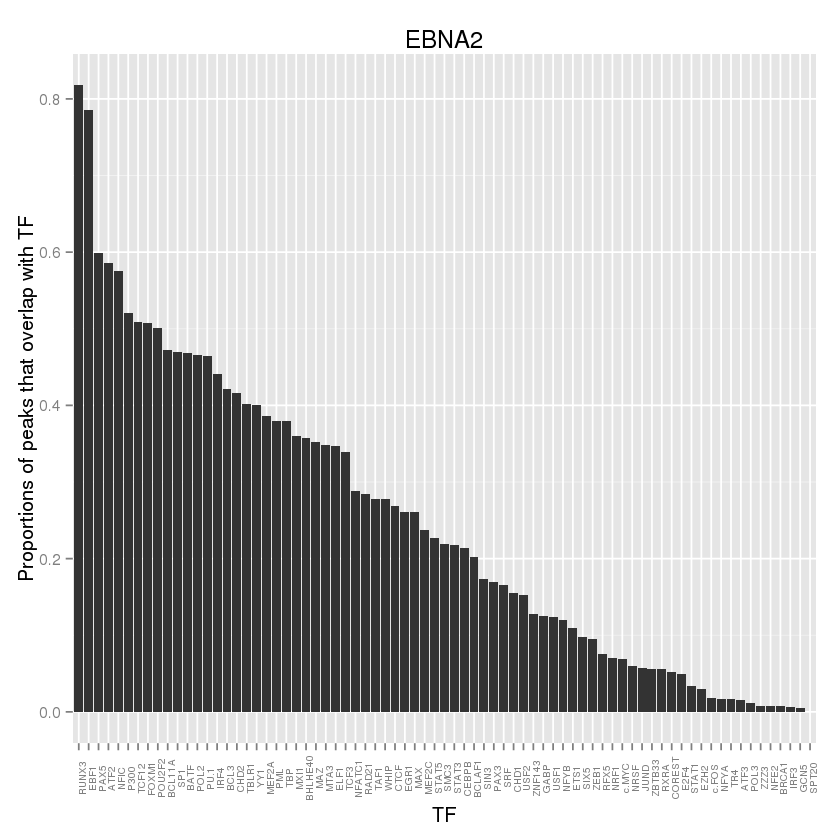
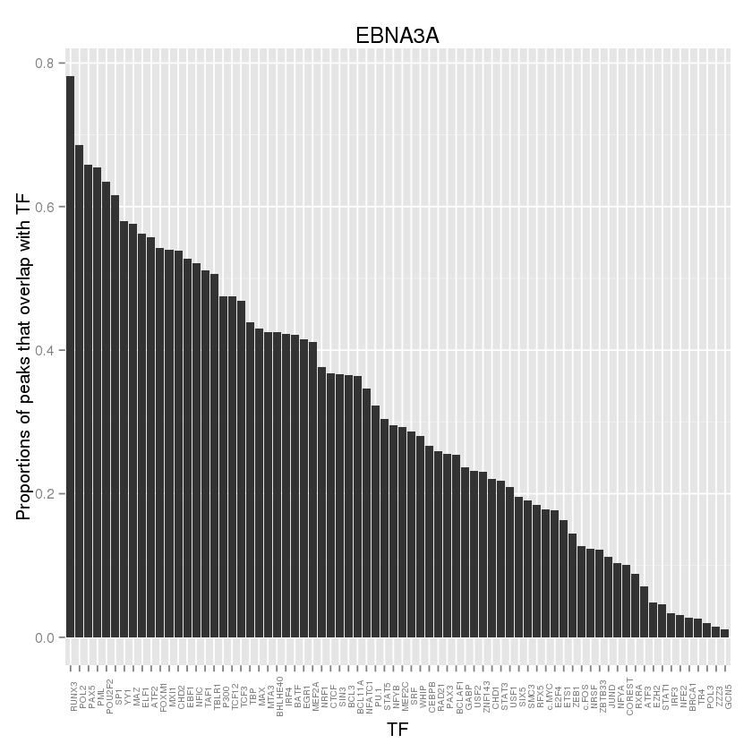
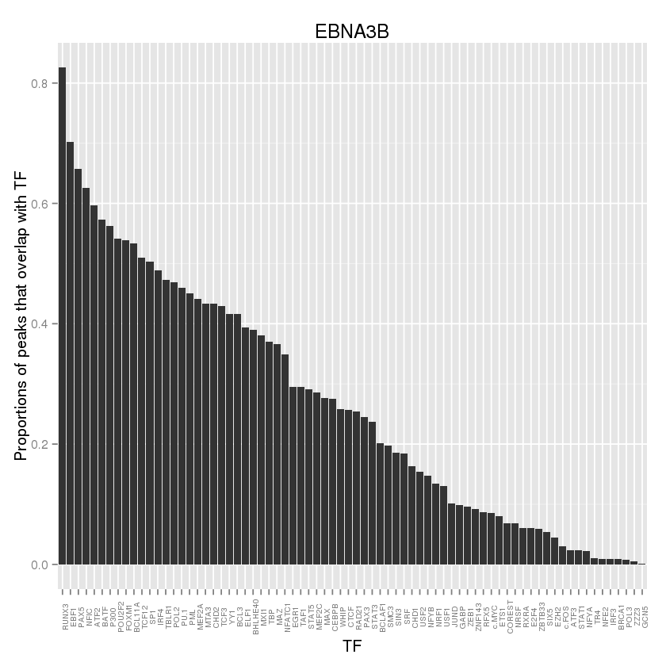
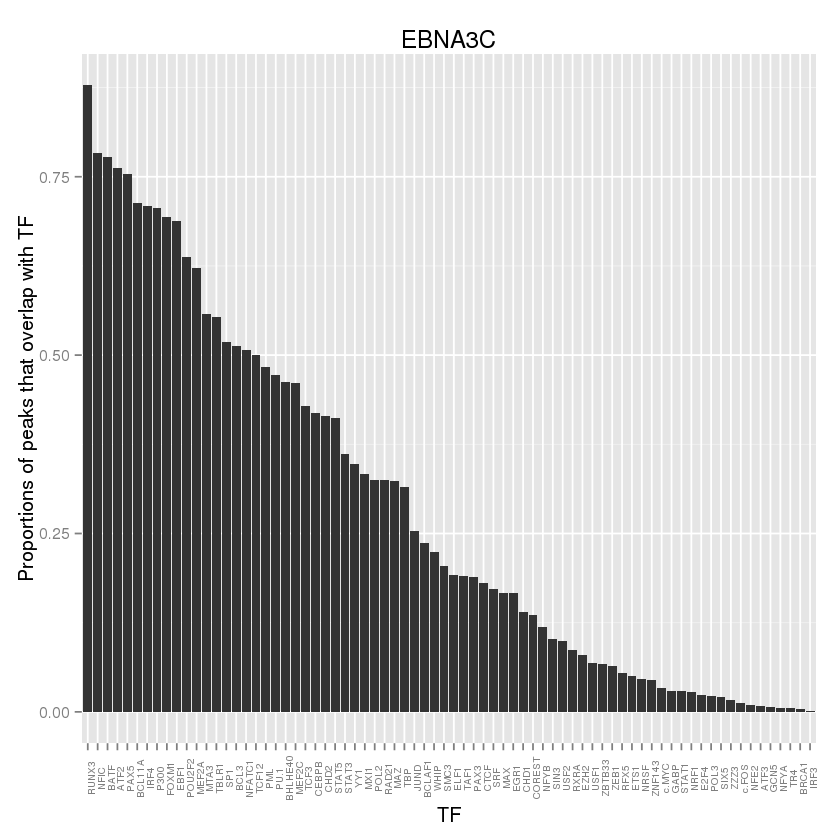
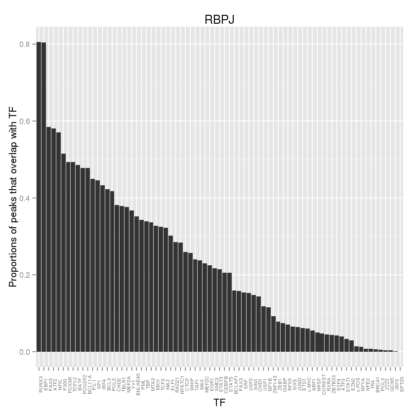

### Heatmaps analysis

For this analysis we are considering the rows after already filtering
the peaks that overlap any of the blacklisted regions and the columns
are already grouped by transcription factors.


#### Filtering to peaks that overlap Dnase hypersensitive sites

We generate the matrices and proportion vectors:


```r
mats <- mcmapply(build_binary_matrix, names(ranges),ranges,
  MoreArgs = list(expr = "Dnase == 1",
             col_expr = cols_to_remove(pattern,'columns')),
			 SIMPLIFY=FALSE,mc.silent=TRUE,mc.cores = mc)

proportions <- lapply(mats,get_proportions)
```


     

If we calculate the proportions of each TF, and sort them we can get the following:

     


