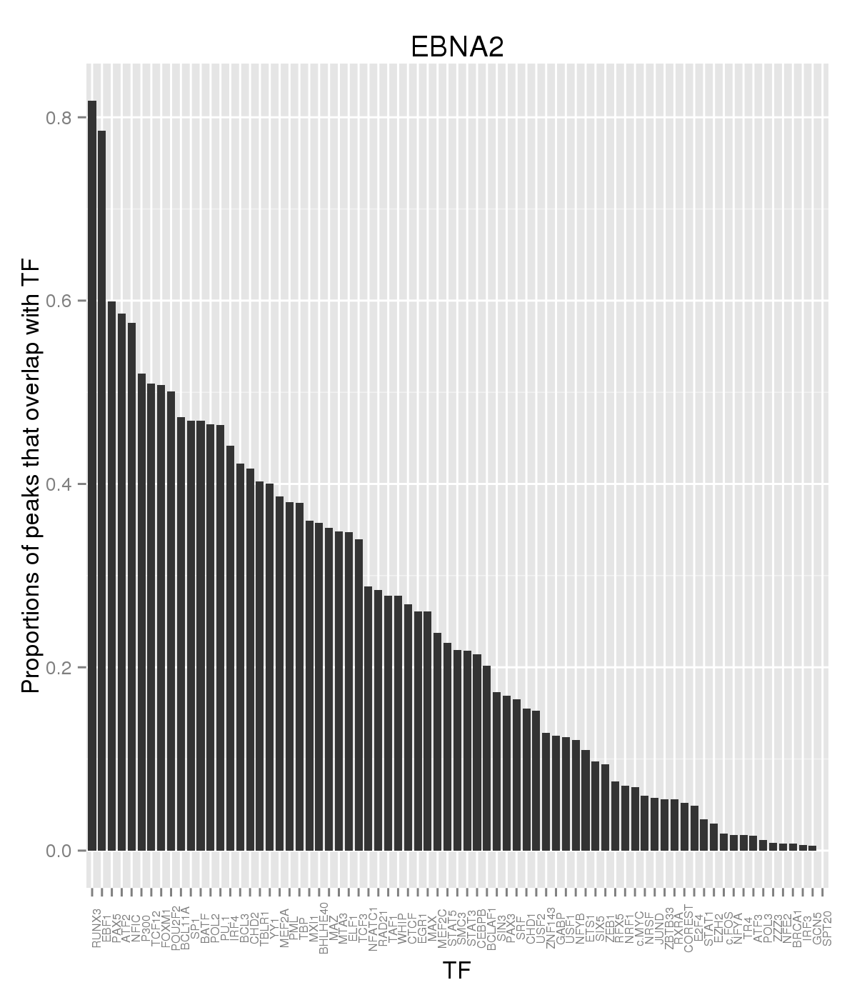
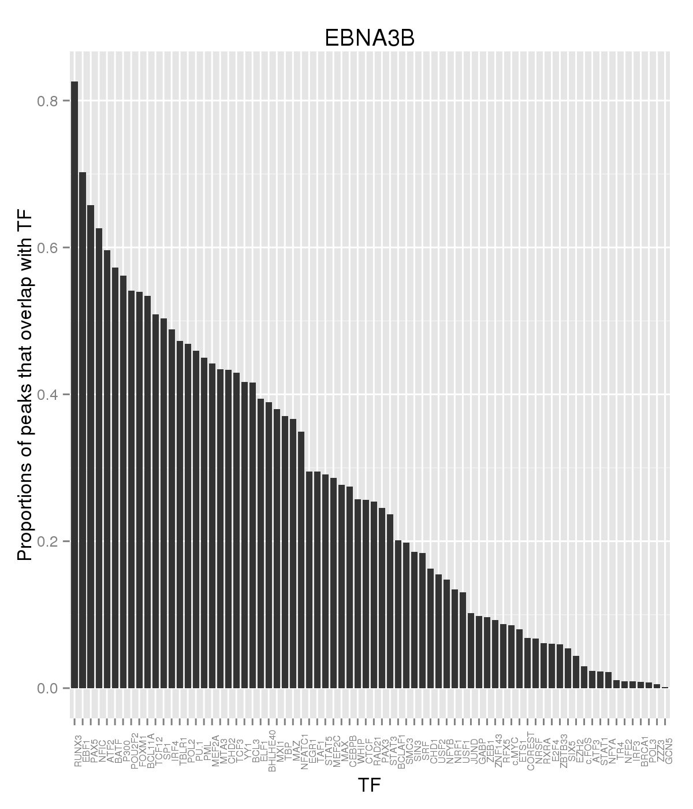
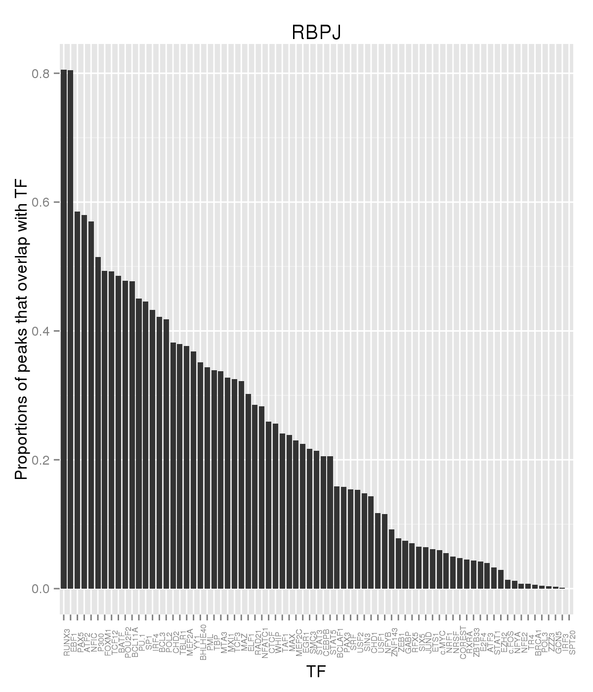

### Heatmaps analysis

For this analysis we are considering the rows after already filtering
the peaks that overlap any of the blacklisted regions and the columns
are already grouped by transcription factors.


#### Filtering to peaks that overlap Dnase hypersensitive sites


We generate the matrices and proportion vectors:


```r
mats <- mcmapply(build_binary_matrix, names(ranges),ranges,
  MoreArgs = list(expr = "Dnase == 1",
             col_expr = cols_to_remove(pattern,'columns')),
			 SIMPLIFY=FALSE,mc.silent=TRUE,mc.cores = mc)

proportions <- lapply(mats,get_proportions)
```


We can see that the top 10, TFs are for each dataset:


|   |EBNA2  |EBNA3A |EBNA3B |EBNA3C |JK92   |JK234 |RBPJ   |
|:--|:------|:------|:------|:------|:------|:-----|:------|
|1  |RUNX3  |RUNX3  |RUNX3  |RUNX3  |RUNX3  |EBF1  |RUNX3  |
|2  |EBF1   |POL2   |EBF1   |NFIC   |EBF1   |RUNX3 |EBF1   |
|3  |PAX5   |PAX5   |PAX5   |BATF   |PAX5   |ATF2  |PAX5   |
|4  |ATF2   |PML    |NFIC   |ATF2   |ATF2   |NFIC  |ATF2   |
|5  |NFIC   |POU2F2 |ATF2   |PAX5   |NFIC   |PAX5  |NFIC   |
|6  |P300   |SP1    |BATF   |BCL11A |P300   |P300  |P300   |
|7  |TCF12  |YY1    |P300   |IRF4   |TCF12  |TCF12 |FOXM1  |
|8  |FOXM1  |MAZ    |POU2F2 |P300   |FOXM1  |BATF  |TCF12  |
|9  |POU2F2 |ELF1   |FOXM1  |FOXM1  |POU2F2 |FOXM1 |BATF   |
|10 |BCL11A |ATF2   |BCL11A |EBF1   |BATF   |BCL3  |POU2F2 |

It is worth noticing that several entries of the table above
coincide. In particular RUNX3, EBF1, PAX5, etc.


     

If we calculate the proportions of each TF, and sort them we can get the following:

     


