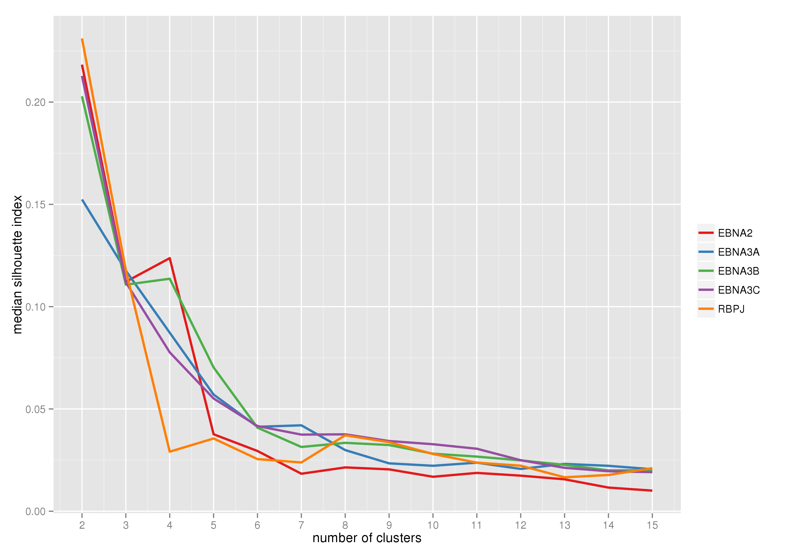

>
## Partition around medoids analysis

Following the heatmap analysis where we were able to asses that there
is in fact some structure in the data. We considered using the
partition around medoids clustering strategy, where the only parameter
that is needed to tune is the number of clusters. Therefore, we
clustered the data considering k between 2 and 15.


If we make boxplots of the silhouette index for each point and
separate them by number of clusters and dataset, we can see that the
biggest separation is occuring when there are two clusters, which
agrees with the heatmaps. When using a higher number of clusters we
can see that the range of the boxplots stabilizes:


 

The median silhouette index for each k behaves as:

 


In this case, since we see a decreasing tendency in the silhouette
index, and we want to consider a greater selection of clusters than
two, we consider K=10. So, we consider that amount of clusters and
calculate the number proportions of peaks overlapping a specific
transcription factor per cluster. The barplots of this data are at the bottom.


In the proportion plots at the bottom, it is possible to see which
transcription factors overlaps with most of the peaks in each
cluster. For this part, we are going to consider two strategies to
identify which factors may be the drivers. One is to consider the
active TFs as the union of the top 10 TF per cluster, and the
other is to consider this set as the union of all TFs such that
overlaps at least the 75% of all the peaks in a cluster.

### Top 10 strategy

For each peak set, we obtain the top 10 TFs in each cluster,
bellow the union of all drivers in a cluster are shown.

We can see that despite having more than 70 TFs, it seem that there
are some drivers which are repetitive in all peak sets. On the other
hand, it seems that there are some drivers that are peak set
exclusive.


```r
top_TFs <- lapply(peaks,top_strategy,props,top)
names(top_TFs) <- peaks
top_TFs
```

```
## $EBNA2
##  [1] "POL2"   "ELF1"   "YY1"    "RUNX3"  "PML"    "MXI1"   "TAF1"  
##  [8] "GABP"   "CHD2"   "MAZ"    "NFIC"   "EBF1"   "ATF2"   "PAX5"  
## [15] "BCL11A" "P300"   "FOXM1"  "BATF"   "IRF4"   "POU2F2" "SP1"   
## [22] "MEF2A"  "MTA3"   "PU.1"   "CTCF"   "TCF12"  "TBP"    "BCL3"  
## 
## $EBNA3A
##  [1] "POL2"   "MXI1"   "MAZ"    "PML"    "ELF1"   "CHD2"   "YY1"   
##  [8] "TAF1"   "SIN3"   "MAX"    "CTCF"   "NRF1"   "RUNX3"  "RAD21" 
## [15] "SP1"    "EGR1"   "ATF2"   "P300"   "FOXM1"  "PAX5"   "NFIC"  
## [22] "POU2F2" "TBLR1"  "BCL11A" "BATF"   "IRF4"   "NFYB"   "c.FOS" 
## [29] "EBF1"   "NFATC1" "MTA3"  
## 
## $EBNA3B
##  [1] "POL2"   "ELF1"   "PML"    "TAF1"   "MAZ"    "MXI1"   "NRF1"  
##  [8] "YY1"    "RUNX3"  "CHD2"   "PAX5"   "FOXM1"  "ATF2"   "SP1"   
## [15] "TCF12"  "P300"   "IRF4"   "NFIC"   "BCL11A" "MEF2A"  "MTA3"  
## [22] "EBF1"   "BATF"   "PU.1"   "CTCF"   "PAX3"   "POU2F2"
## 
## $EBNA3C
##  [1] "RUNX3"  "PAX5"   "EBF1"   "BATF"   "PU.1"   "POL2"   "POU2F2"
##  [8] "P300"   "IRF4"   "NFIC"   "FOXM1"  "TCF12"  "ATF2"   "SP1"   
## [15] "BCL11A" "MEF2A"  "NFATC1" "MEF2C"  "MTA3"   "TBLR1"  "CTCF"  
## [22] "RAD21"  "SMC3"   "YY1"    "ZNF143" "TCF3"   "ELF1"  
## 
## $RBPJ
##  [1] "EBF1"   "PU.1"   "CTCF"   "PAX5"   "POL2"   "TCF12"  "BATF"  
##  [8] "POU2F2" "RAD21"  "P300"   "ELF1"   "MXI1"   "PML"    "YY1"   
## [15] "TAF1"   "RUNX3"  "SP1"    "CHD2"   "MAZ"    "ATF2"   "FOXM1" 
## [22] "NFIC"   "BCL11A" "BCL3"   "MEF2A"  "IRF4"   "MTA3"
```

In particlar the top 10 TFs that are common to all peak sets are:


```r
Reduce(intersect,top_TFs)
```

```
##  [1] "POL2"   "ELF1"   "YY1"    "RUNX3"  "NFIC"   "EBF1"   "ATF2"  
##  [8] "PAX5"   "BCL11A" "P300"   "FOXM1"  "BATF"   "IRF4"   "POU2F2"
## [15] "SP1"    "MTA3"   "CTCF"
```


### TF overlaps more than 75% of peaks in cluster


```r
cut_TFs <- lapply(peaks,cut_strategy,props,cutline)
names(cut_TFs) <- peaks
cut_TFs
```

```
## $EBNA2
##  [1] "ATF2"    "BATF"    "BCL11A"  "BCL3"    "BCLAF1"  "BHLHE40" "CHD2"   
##  [8] "EBF1"    "EGR1"    "ELF1"    "FOXM1"   "GABP"    "IRF4"    "MAX"    
## [15] "MAZ"     "MEF2A"   "MTA3"    "MXI1"    "NFATC1"  "NFIC"    "P300"   
## [22] "PAX5"    "PML"     "POL2"    "POU2F2"  "RUNX3"   "SIN3"    "SP1"    
## [29] "TAF1"    "TBLR1"   "TBP"     "TCF12"   "TCF3"    "WHIP"    "YY1"    
## 
## $EBNA3A
##  [1] "ATF2"    "BATF"    "BCL11A"  "BCL3"    "BHLHE40" "c.FOS"   "CEBPB"  
##  [8] "CHD2"    "EBF1"    "EGR1"    "ELF1"    "FOXM1"   "IRF4"    "MAX"    
## [15] "MAZ"     "MEF2A"   "MEF2C"   "MTA3"    "MXI1"    "NFATC1"  "NFIC"   
## [22] "NFYB"    "NRF1"    "P300"    "PAX3"    "PAX5"    "PML"     "POL2"   
## [29] "POU2F2"  "RUNX3"   "SIN3"    "SP1"     "STAT5"   "TAF1"    "TBLR1"  
## [36] "TBP"     "TCF12"   "TCF3"    "USF2"    "YY1"    
## 
## $EBNA3B
##  [1] "ATF2"    "BATF"    "BCL11A"  "BCL3"    "BCLAF1"  "BHLHE40" "CEBPB"  
##  [8] "CHD2"    "EBF1"    "EGR1"    "ELF1"    "FOXM1"   "IRF4"    "MAX"    
## [15] "MAZ"     "MEF2A"   "MEF2C"   "MTA3"    "MXI1"    "NFATC1"  "NFIC"   
## [22] "NRF1"    "P300"    "PAX5"    "PML"     "POL2"    "POU2F2"  "RUNX3"  
## [29] "SP1"     "STAT3"   "STAT5"   "TAF1"    "TBLR1"   "TBP"     "TCF12"  
## [36] "TCF3"    "YY1"    
## 
## $EBNA3C
##  [1] "ATF2"    "BATF"    "BCL11A"  "BCL3"    "BCLAF1"  "BHLHE40" "CEBPB"  
##  [8] "CHD2"    "CTCF"    "EBF1"    "EGR1"    "FOXM1"   "IRF4"    "MAZ"    
## [15] "MEF2A"   "MEF2C"   "MTA3"    "MXI1"    "NFATC1"  "NFIC"    "P300"   
## [22] "PAX5"    "PML"     "POL2"    "POU2F2"  "RAD21"   "RUNX3"   "SMC3"   
## [29] "SP1"     "STAT3"   "STAT5"   "TBLR1"   "TBP"     "TCF12"   "TCF3"   
## [36] "YY1"    
## 
## $RBPJ
##  [1] "ATF2"    "BATF"    "BCL11A"  "BCL3"    "BHLHE40" "CHD2"    "CTCF"   
##  [8] "EBF1"    "ELF1"    "FOXM1"   "IRF4"    "MAX"     "MAZ"     "MEF2A"  
## [15] "MTA3"    "MXI1"    "NFATC1"  "NFIC"    "P300"    "PAX5"    "PML"    
## [22] "POL2"    "POU2F2"  "RUNX3"   "SIN3"    "SIX5"    "SP1"     "SRF"    
## [29] "TAF1"    "TBLR1"   "TBP"     "TCF12"   "TCF3"    "YY1"
```

The common TFs with a cluster specfic overlap proportion greater thatn
0.75 are:


```r
Reduce(intersect,cut_TFs)
```

```
##  [1] "ATF2"    "BATF"    "BCL11A"  "BCL3"    "BHLHE40" "CHD2"    "EBF1"   
##  [8] "FOXM1"   "IRF4"    "MAZ"     "MEF2A"   "MTA3"    "MXI1"    "NFATC1" 
## [15] "NFIC"    "P300"    "PAX5"    "PML"     "POL2"    "POU2F2"  "RUNX3"  
## [22] "SP1"     "TBLR1"   "TBP"     "TCF12"   "TCF3"    "YY1"
```


### Transcription factor barplots when Dnase == 1 and K=10

     

