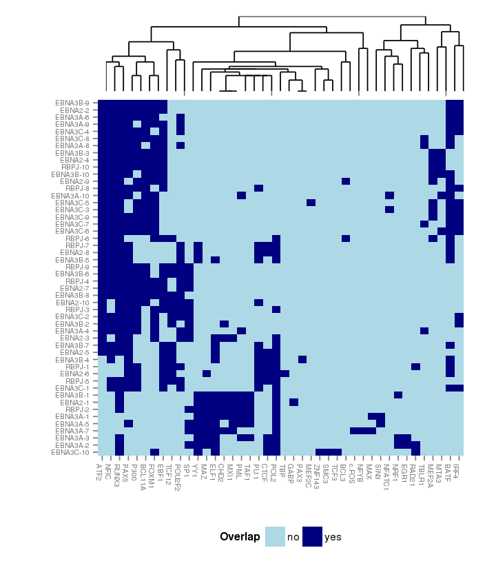
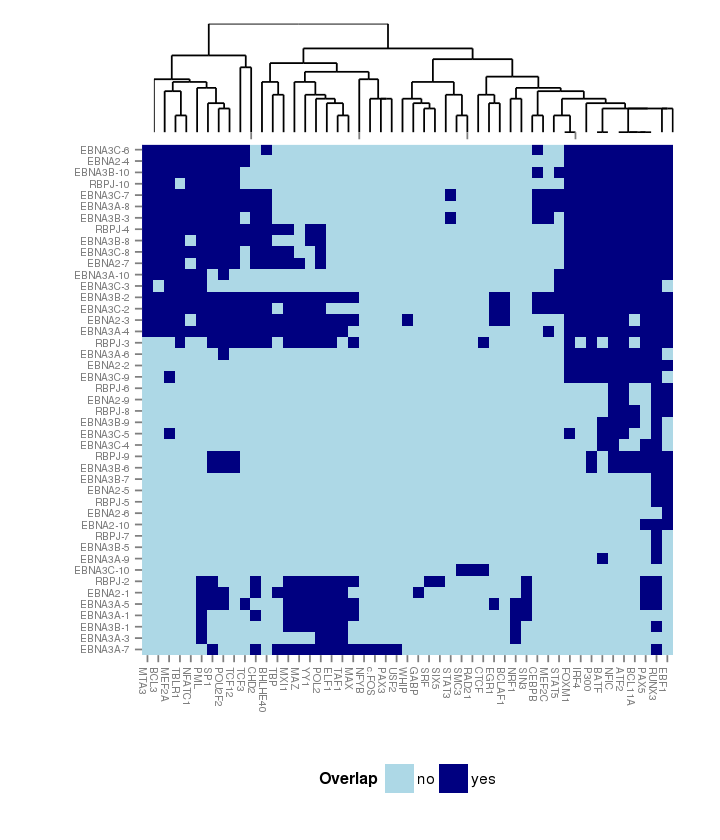

>## Partition around medoids analysis

In the previous analysis we considered clustering the peak set
specific matrices filtering the regions that didn't overlap DHS and
then we calculated the frequency of overlapping peaks in a cluster
with a specific TF. That way, we considered two strategies to
integrate the clusters of the different peak sets.

That way we built two different indidence matrix:

1. One where the rows represent one of the 10 clusters of each
   dataset (i.e. 50 rows) and the columns are the
   union of the top 10 TFs for each peaksets.

 
   
2. Again the rows represent one of the 10 clusters of each datasets
   (excepting the clusters where there are not TFs such that its
   overlap frequency is greater 75%). And the columns
   represent the union of all TFs such that its overlapping frequency
   respect the peaks in the cluster is greater than 75%.

 

