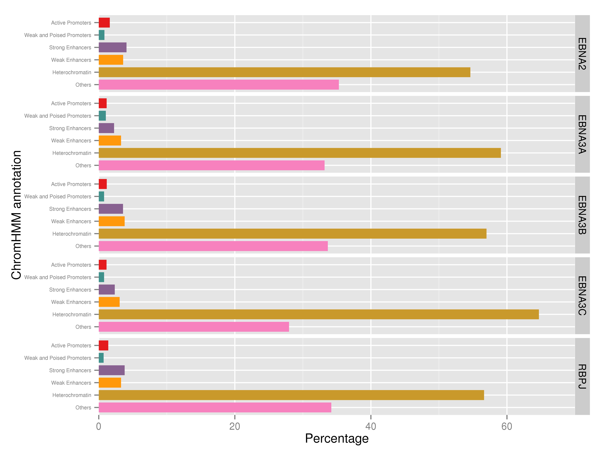

## Enhancer segmentation of EBNA peaks

For this part, we considered the annotation of the EBNA to ENCODE's
enhancer segmentation. This segmentation is the latest, and the states
considered are explained in
[here](https://genome.ucsc.edu/cgi-bin/hgTrackUi?g=wgEncodeAwgSegmentation&db=hg19):

- TSS	Predicted promoter region including TSS
- PF	Predicted promoter flanking region
- E		Predicted enhancer
- WE	Predicted weak enhancer or open chromatin cis regulatory element
- CTCF	CTCF enriched element
- T		Predicted transcribed region
- R		Repressed or Low Activity region


The data used for our case was extracted from
[here](https://www.encodeproject.org/datasets/ENCSR212BHV/)

Roughly speaking, we took all the EBV peaks (considering two separate
cases, before and after filtering the ones that overlap Dnase
hypersensitive sites), and look for annotation that corresponds
according to the chromHMM - Segway segmentation. In case of a tie, we
considered the annotation as the one that occupied the largest number
of bp in the peak. We have built the chance to use the first or last
labels too respect to the 5' coordinates.


### All the peaks


The number of peaks that overlap each annotation are given by:


```
##         label
## set       TSS   PF    E   WE CTCF    T    R
##   EBNA2  1410 2089 2985  288  157 1848   39
##   EBNA3A  516  216  223    5   57  605   29
##   EBNA3B  506  817  911   54   38  697   28
##   EBNA3C  239  629  689   47  153 1797   57
##   JK234   356  983 1322  123   97 1369   43
##   JK92   1027 1711 2874  293  179 2049   42
##   RBPJ   1136 2030 3221  310  253 2985   82
```

 

### Overlap with DHS


The number of peaks that overlap each annotation and DHS are given by:


```
##         label
## set       TSS   PF    E   WE CTCF    T    R
##   EBNA2  1403 2072 2846  261   96 1197   25
##   EBNA3A  511  210  202    5    8  112   14
##   EBNA3B  503  812  886   54   19  363   19
##   EBNA3C  227  616  643   42   20  228   25
##   JK234   353  979 1307  121   43  561   24
##   JK92   1023 1705 2786  276  121 1432   27
##   RBPJ   1129 2020 3118  292  141 1612   48
```

 

