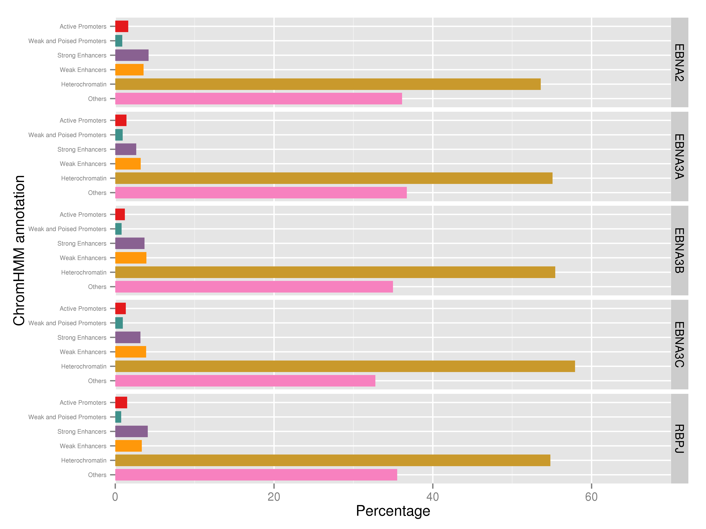

## Enhancer segmentation of EBNA peaks

For this part, we considered the annotation of the EBNA to ENCODE's
enhancer segmentation. This segmentation is older and was made by
using the hg18 genome, therefore there are some peaks for which there
is no state available. The states are explained in
[here](https://genome.ucsc.edu/cgi-bin/hgTrackUi?db=hg19&g=wgEncodeBroadHmm)

Roughly speaking, we took all the EBV peaks (considering two separate
cases, before and after filtering the ones that overlap Dnase
hypersensitive sites), and look for annotation that corresponds
according to the liftOver'ed chromHMM segmentation (from hg18 to
hg19). In case of a tie, we considered the annotation as the one that
occupied the largest number of bp in the peak. We have built the
chance to use the first or last labels too respect to the 5'
coordinates.


### All the peaks


The number of peaks that overlap each annotation are given by:


```
##         label
## set      0_none 1_Active_Promoter 2_Weak_Promoter 3_Poised_Promoter
##   EBNA2     121               142              61                12
##   EBNA3A     35                19              13                 4
##   EBNA3B     44                36              23                 1
##   EBNA3C     62                41              25                 3
##   JK234      57                60              24                 5
##   JK92      106               126              44                12
##   RBPJ      134               139              59                13
##         label
## set      4_Strong_Enhancer 5_Strong_Enhancer 6_Weak_Enhancer
##   EBNA2                194               165              80
##   EBNA3A                20                17              12
##   EBNA3B                59                50              29
##   EBNA3C                40                45              26
##   JK234                 86                76              25
##   JK92                 171               148              60
##   RBPJ                 204               177              73
##         label
## set      7_Weak_Enhancer 8_Insulator 9_Txn_Transition 10_Txn_Elongation
##   EBNA2              236          18              136               913
##   EBNA3A              42           4               29               142
##   EBNA3B              87           3               54               274
##   EBNA3C              85           4               31               238
##   JK234              119           2               66               377
##   JK92               207           9              124               854
##   RBPJ               255          10              148               989
##         label
## set      11_Weak_Txn 12_Repressed 13_Heterochrom/lo 14_Repetitive/CNV
##   EBNA2         1586          332              4815                 3
##   EBNA3A         264           72               976                 2
##   EBNA3B         535          113              1739                 3
##   EBNA3C         517          151              2336                 6
##   JK234          750          137              2505                 4
##   JK92          1495          285              4533                 1
##   RBPJ          1788          350              5673                 5
##         label
## set      15_Repetitive/CNV
##   EBNA2                  2
##   EBNA3A                 0
##   EBNA3B                 1
##   EBNA3C                 1
##   JK234                  0
##   JK92                   0
##   RBPJ                   0
```

 

### Overlap with DHS

The number of peaks that overlap each annotation and DHS are given by:


```
##         label
## set      0_none 1_Active_Promoter 2_Weak_Promoter 3_Poised_Promoter
##   EBNA2     107               129              59                11
##   EBNA3A     19                15               7                 3
##   EBNA3B     35                32              20                 1
##   EBNA3C     25                24              14                 3
##   JK234      40                51              20                 4
##   JK92       94               119              41                11
##   RBPJ      105               125              52                11
##         label
## set      4_Strong_Enhancer 5_Strong_Enhancer 6_Weak_Enhancer
##   EBNA2                178               154              69
##   EBNA3A                16                12               8
##   EBNA3B                54                44              27
##   EBNA3C                26                31              19
##   JK234                 81                67              19
##   JK92                 160               134              54
##   RBPJ                 188               154              61
##         label
## set      7_Weak_Enhancer 8_Insulator 9_Txn_Transition 10_Txn_Elongation
##   EBNA2              212          17              125               840
##   EBNA3A              26           2               26               107
##   EBNA3B              77           3               52               249
##   EBNA3C              51           2               18               140
##   JK234               98           1               58               318
##   JK92               189           8              114               787
##   RBPJ               218           8              131               865
##         label
## set      11_Weak_Txn 12_Repressed 13_Heterochrom/lo 14_Repetitive/CNV
##   EBNA2         1461          299              4234                 3
##   EBNA3A         181           53               585                 2
##   EBNA3B         487          101              1472                 1
##   EBNA3C         310           93              1043                 2
##   JK234          640          108              1881                 2
##   JK92          1375          259              4024                 1
##   RBPJ          1560          297              4582                 3
##         label
## set      15_Repetitive/CNV
##   EBNA2                  2
##   EBNA3A                 0
##   EBNA3B                 1
##   EBNA3C                 0
##   JK234                  0
##   JK92                   0
##   RBPJ                   0
```

 

