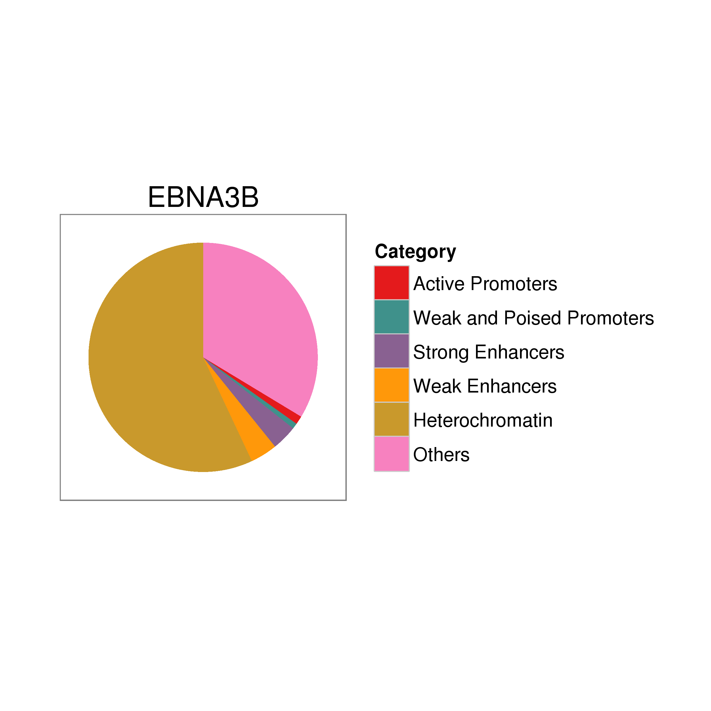

## Enhancer segmentation of EBNA peaks

For this part, we considered the annotation of the EBNA to ENCODE's
enhancer segmentation. This segmentation is older and was made by
using the hg18 genome, therefore there are some peaks for which there
is no state available. The states are explained in
[here](https://genome.ucsc.edu/cgi-bin/hgTrackUi?db=hg19&g=wgEncodeBroadHmm)

Roughly speaking, we took all the EBV peaks (considering two separate
cases, before and after filtering the ones that overlap Dnase
hypersensitive sites), and look for annotation that corresponds
according to the liftOver'ed chromHMM segmentation (from hg18 to
hg19). In case of a tie, we considered the annotation as the one that
occupied the largest number of bp in the peak. We have built the
chance to use the first or last labels too respect to the 5'
coordinates.

Since in the original annotation there are 3 labels that are repeated,
those were joined together with their respective pair and the
enumeration was altered a little bit. In total we had 13 categories:

- Original 15
- Minus 3 repeated
- Plus 1 added with the regions missing by the liftOver


### All the peaks


The number of peaks that overlap each annotation are given by:


```
##         label
## set      0_none 1_Active_Promoter 2_Weak_Promoter 3_Poised_Promoter
##   EBNA2     121               142              61                12
##   EBNA3A     35                19              13                 4
##   EBNA3B     44                36              23                 1
##   EBNA3C     62                41              25                 3
##   JK234      57                60              24                 5
##   JK92      106               126              44                12
##   RBPJ      134               139              59                13
##         label
## set      4_Strong_Enhancer 5_Weak_Enhancer 6_Insulator 7_Txn_Transition
##   EBNA2                359             316          18              136
##   EBNA3A                37              54           4               29
##   EBNA3B               109             116           3               54
##   EBNA3C                85             111           4               31
##   JK234                162             144           2               66
##   JK92                 319             267           9              124
##   RBPJ                 381             328          10              148
##         label
## set      8_Txn_Elongation 9_Weak_Txn 10_Repressed 11_Heterochrom/lo
##   EBNA2               913       1586          332              4815
##   EBNA3A              142        264           72               976
##   EBNA3B              274        535          113              1739
##   EBNA3C              238        517          151              2336
##   JK234               377        750          137              2505
##   JK92                854       1495          285              4533
##   RBPJ                989       1788          350              5673
##         label
## set      12_Repetitive/CNV
##   EBNA2                  5
##   EBNA3A                 2
##   EBNA3B                 4
##   EBNA3C                 7
##   JK234                  4
##   JK92                   1
##   RBPJ                   5
```

 

     

### Overlap with DHS

The number of peaks that overlap each annotation and DHS are given by:


```
##         label
## set      0_none 1_Active_Promoter 2_Weak_Promoter 3_Poised_Promoter
##   EBNA2     107               129              59                11
##   EBNA3A     19                15               7                 3
##   EBNA3B     35                32              20                 1
##   EBNA3C     25                24              14                 3
##   JK234      40                51              20                 4
##   JK92       94               119              41                11
##   RBPJ      105               125              52                11
##         label
## set      4_Strong_Enhancer 5_Weak_Enhancer 6_Insulator 7_Txn_Transition
##   EBNA2                332             281          17              125
##   EBNA3A                28              34           2               26
##   EBNA3B                98             104           3               52
##   EBNA3C                57              70           2               18
##   JK234                148             117           1               58
##   JK92                 294             243           8              114
##   RBPJ                 342             279           8              131
##         label
## set      8_Txn_Elongation 9_Weak_Txn 10_Repressed 11_Heterochrom/lo
##   EBNA2               840       1461          299              4234
##   EBNA3A              107        181           53               585
##   EBNA3B              249        487          101              1472
##   EBNA3C              140        310           93              1043
##   JK234               318        640          108              1881
##   JK92                787       1375          259              4024
##   RBPJ                865       1560          297              4582
##         label
## set      12_Repetitive/CNV
##   EBNA2                  5
##   EBNA3A                 2
##   EBNA3B                 2
##   EBNA3C                 2
##   JK234                  2
##   JK92                   1
##   RBPJ                   3
```

 

     
