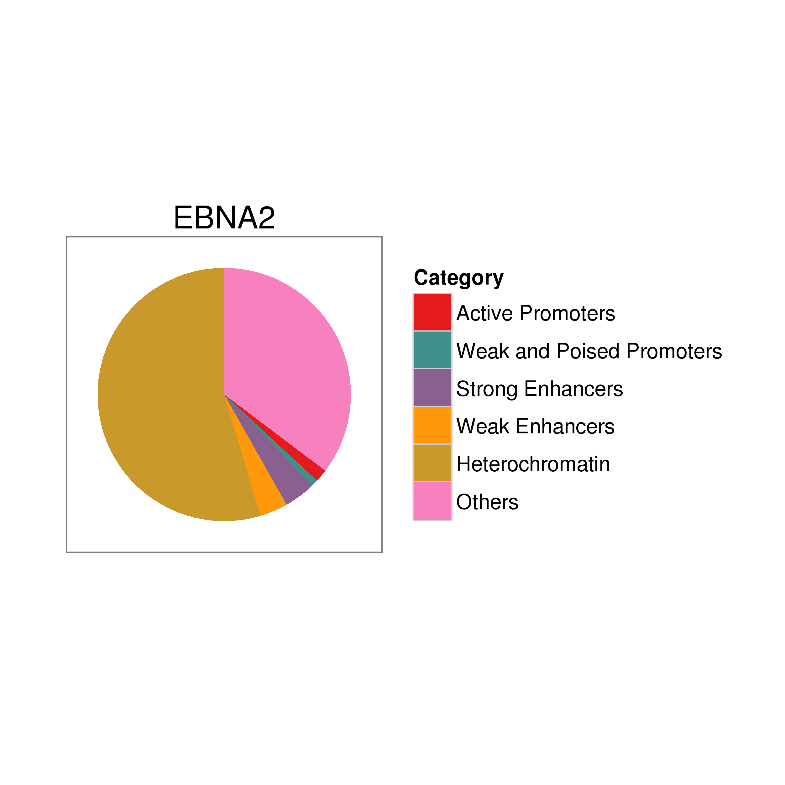
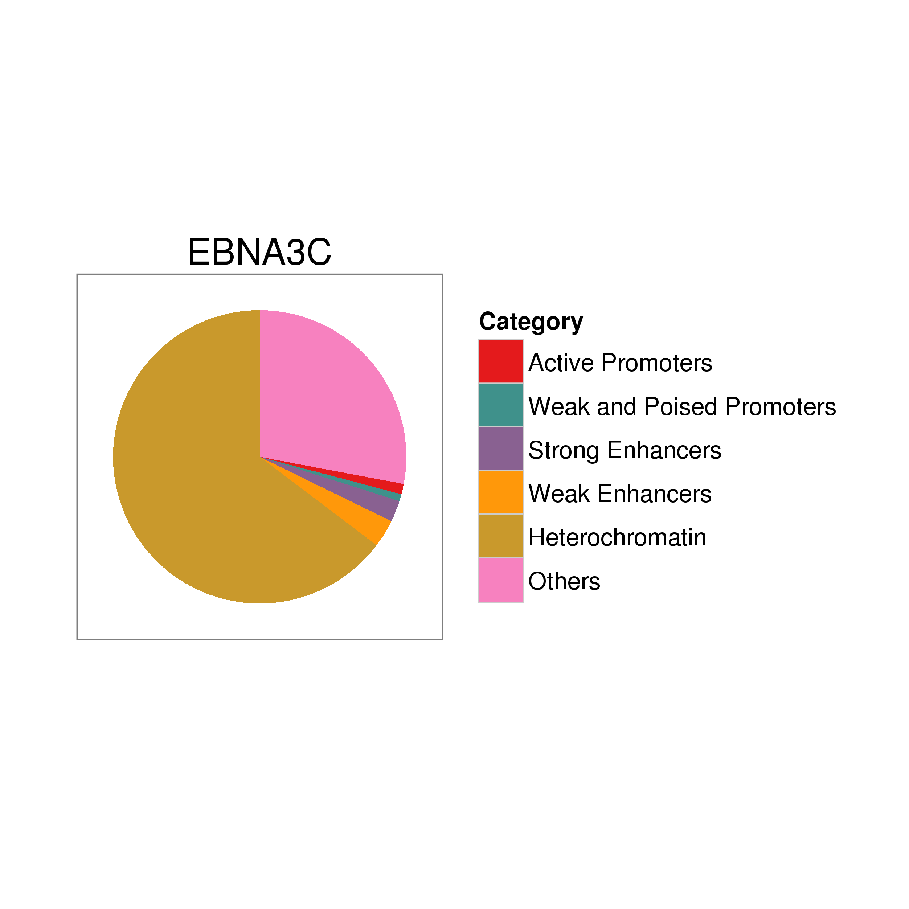
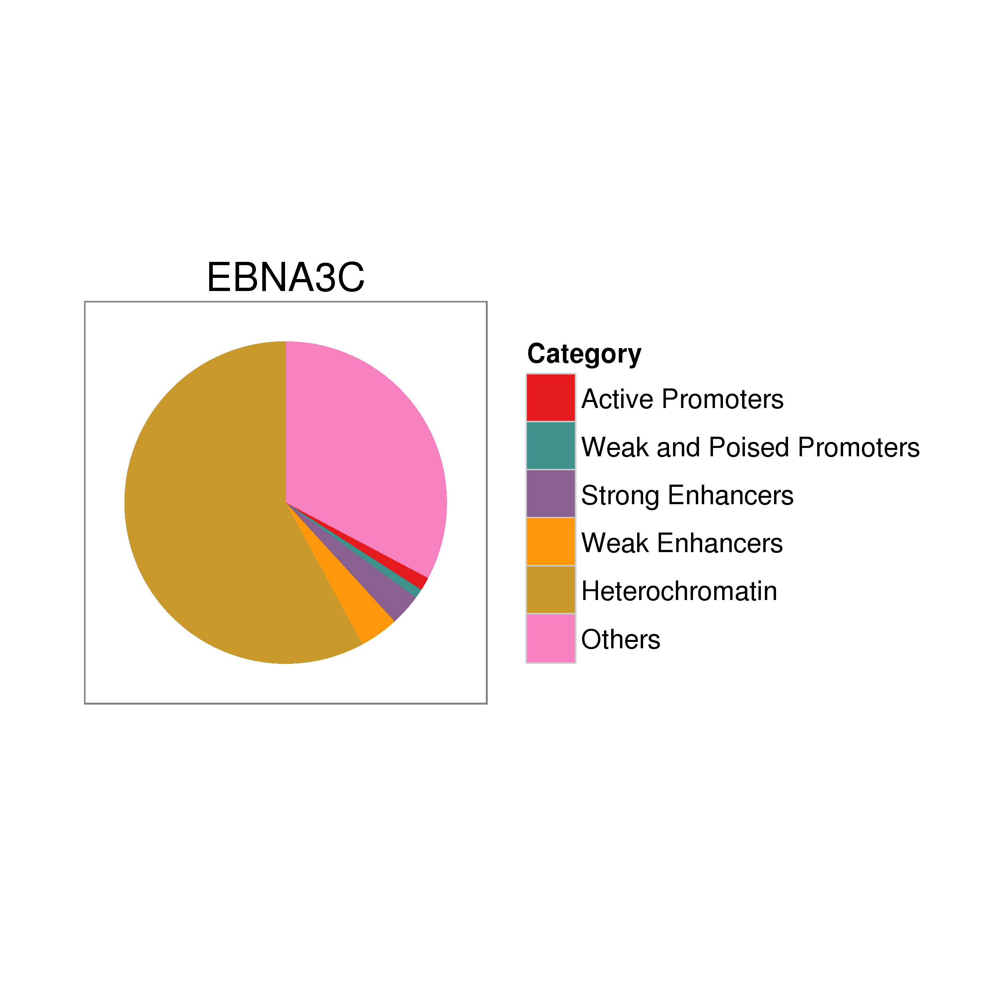

## Enhancer segmentation of EBNA peaks

For this part, we considered the annotation of the EBNA to ENCODE's
enhancer segmentation. This segmentation is older and was made by
using the hg18 genome, therefore there are some peaks for which there
is no state available. The states are explained in
[here](https://genome.ucsc.edu/cgi-bin/hgTrackUi?db=hg19&g=wgEncodeBroadHmm)

Roughly speaking, we took all the EBV peaks (considering two separate
cases, before and after filtering the ones that overlap Dnase
hypersensitive sites), and look for annotation that corresponds
according to the liftOver'ed chromHMM segmentation (from hg18 to
hg19). In case of a tie, we considered the annotation as the one that
occupied the largest number of bp in the peak. We have built the
chance to use the first or last labels too respect to the 5'
coordinates.

Since in the original annotation there are 3 labels that are repeated,
those were joined together with their respective pair and the
enumeration was altered a little bit. In total we had 13 categories:

- Original 15
- Minus 3 repeated
- Plus 1 added with the regions missing by the liftOver


### All the peaks


The number of peaks that overlap each annotation are given by:


```
##         label
## set      Others Active Promoters Weak and Poised Promoters
##   EBNA2    3111              142                        73
##   EBNA3A    548               19                        17
##   EBNA3B   1027               36                        24
##   EBNA3C   1010               41                        28
##   JK234    1393               60                        29
##   JK92     2874              126                        56
##   RBPJ     3424              139                        72
##         label
## set      Strong Enhancers Weak Enhancers Heterochromatin
##   EBNA2               359            316            4815
##   EBNA3A               37             54             976
##   EBNA3B              109            116            1739
##   EBNA3C               85            111            2336
##   JK234               162            144            2505
##   JK92                319            267            4533
##   RBPJ                381            328            5673
```

 

     

### Overlap with DHS

The number of peaks that overlap each annotation and DHS are given by:


```
##         label
## set      Others Active Promoters Weak and Poised Promoters
##   EBNA2    2854              129                        70
##   EBNA3A    390               15                        10
##   EBNA3B    929               32                        21
##   EBNA3C    590               24                        17
##   JK234    1167               51                        24
##   JK92     2638              119                        52
##   RBPJ     2969              125                        63
##         label
## set      Strong Enhancers Weak Enhancers Heterochromatin
##   EBNA2               332            281            4234
##   EBNA3A               28             34             585
##   EBNA3B               98            104            1472
##   EBNA3C               57             70            1043
##   JK234               148            117            1881
##   JK92                294            243            4024
##   RBPJ                342            279            4582
```

 

     
